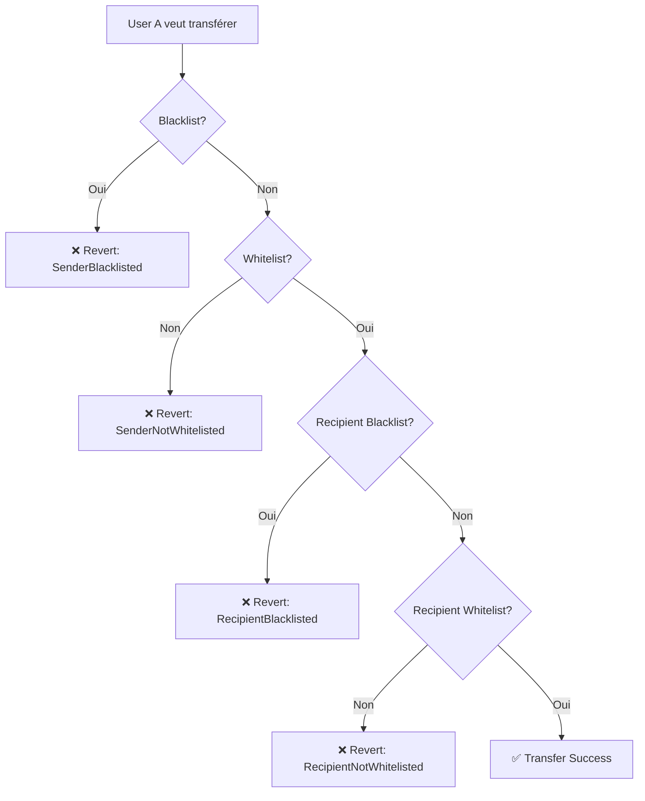

# 📚 Documentation - Tokenized Asset Platform

Bienvenue dans la documentation complète de la plateforme de tokenisation d'actifs réels.

[](../test)
[](../contracts)
[](../test)

## 📖 Table des matières

1. [Introduction](#introduction)
2. [Architecture du Projet](#architecture)
3. [Contrats Principaux](#contrats)
4. [Guides d'Utilisation](#guides)
5. [État du Projet](#état-du-projet)

## Introduction

Cette plateforme permet la **tokenisation complète d'actifs réels** (immobilier, diamants, œuvres d'art, etc.) sur la blockchain Ethereum/Polygon avec **conformité KYC/AML intégrée**.

### 🎯 Objectifs du Projet

- Tokeniser des actifs réels avec conformité réglementaire
- Supporter **deux types de tokens** : Fungible (ERC-20) et Non-Fungible (ERC-721)
- Implémenter un système KYC on-chain robuste
- Préparer l'intégration DEX et oracle

### ✅ Caractéristiques Implémentées (Phase 1 & 2)

#### 🪙 **Tokenisation Complète**
- ✅ **Fungible Assets (ERC-20)** - Propriété fractionnée d'actifs réels
  - Supply management avec plafond
  - Prix par token calculé automatiquement
  - Métadonnées complètes (type, description, documents)
  - Batch minting optimisé
  
- ✅ **Non-Fungible Assets (ERC-721)** - Actifs uniques tokenisés
  - Données individuelles par asset (nom, valuation, certificat)
  - Tracking de la valeur de collection
  - Désactivation/réactivation d'assets
  - Batch minting pour plusieurs NFTs

#### 🔐 **Conformité KYC/AML**
- ✅ **Système KYC Complet**
  - Soumission de documents KYC
  - Processus d'approbation avec expiration
  - Révocation et rejet
  - Batch approval pour plusieurs utilisateurs
  
- ✅ **Whitelist & Blacklist**
  - Whitelist : Seules les adresses KYC approuvées peuvent trader
  - Blacklist : Révocation immédiate (prioritaire sur whitelist)
  - Enforcement on-chain dans `_update()` hooks

#### 🛡️ **Sécurité & Contrôle**
- ✅ **Access Control** - Rôles granulaires (ADMIN, MINTER, PAUSER, KYC_ADMIN)
- ✅ **Pausable** - Arrêt d'urgence des transferts
- ✅ **Burnable** - Destruction de tokens par les détenteurs
- ✅ **Custom Errors** - Gestion d'erreurs gas-efficient
- ✅ **Event Emissions** - Audit trail complet

#### 🧪 **Qualité & Tests**
- ✅ **129 tests passants** (0 échecs)
- ✅ **100% coverage** des fonctions critiques
- ✅ **Edge cases** couverts
- ✅ **Integration scenarios** testés

## Architecture

```
┌───────────────────────────────────────────────────────────────┐
│                    TOKENIZATION LAYER                         │
├───────────────────────────────────────────────────────────────┤
│                                                               │
│  ┌────────────────────────────┐  ┌─────────────────────────┐ │
│  │  FungibleAssetToken        │  │  NFTAssetToken          │ │
│  │  (ERC-20)                  │  │  (ERC-721)              │ │
│  │                            │  │                         │ │
│  │ • Propriété fractionnée    │  │ • Actifs uniques        │ │
│  │ • Supply cap               │  │ • Asset data tracking   │ │
│  │ • Prix/token calculé       │  │ • Valuation updates     │ │
│  │ • Batch minting            │  │ • Certificate URIs      │ │
│  │ • Burn & Pause             │  │ • Collection value      │ │
│  └─────────────┬──────────────┘  └───────────┬─────────────┘ │
│                │                              │               │
│                └──────────────┬───────────────┘               │
│                               │                               │
└───────────────────────────────┼───────────────────────────────┘
                                │
                                │ Vérifie KYC/Whitelist/Blacklist
                                ▼
┌───────────────────────────────────────────────────────────────┐
│                    COMPLIANCE LAYER                           │
├───────────────────────────────────────────────────────────────┤
│                                                               │
│                      KYCRegistry                              │
│                                                               │
│  • Soumission KYC (documents IPFS)                           │
│  • Approbation avec expiration                               │
│  • Révocation & Rejet                                        │
│  • Whitelist (KYC approuvé + non expiré)                    │
│  • Blacklist (priorité sur whitelist)                       │
│  • Batch operations                                          │
│  • Role-based access (KYC_ADMIN)                            │
│                                                               │
└───────────────────────────────────────────────────────────────┘
```

### Flux de Transfer



## Contrats

### 1. [KYCRegistry](./KYCRegistry.md) ✅
**Gestion centralisée de la conformité KYC/AML**

- 📄 ~300 lignes de code
- ✅ 87 tests passants
- 🔐 Rôles: DEFAULT_ADMIN_ROLE, KYC_ADMIN_ROLE
- 🌐 Déployé sur Sepolia: `0xD1FbE41b66f3215ebE1c2703d9f8450De23F7446`

**Fonctions principales:**
- `submitKYC()`, `approveKYC()`, `rejectKYC()`, `revokeKYC()`
- `blacklistAddress()`, `removeFromBlacklist()`
- `batchApproveKYC()`
- `isWhitelisted()`, `isBlacklisted()`, `canTransfer()`

### 2. [FungibleAssetToken](./FungibleAssetToken.md) ✅
**Token ERC-20 pour actifs fractionnés**

- 📄 ~350 lignes de code
- ✅ 36 tests passants
- 🔐 Rôles: ADMIN_ROLE, MINTER_ROLE, PAUSER_ROLE
- 🌐 Déployé sur Sepolia: `0x8B5927CBBb1AE0eA68577b7bBe60318F8CE09eE4`

**Fonctions principales:**
- `mint()`, `batchMint()`, `burn()`, `burnFrom()`
- `pause()`, `unpause()`
- `updateDocumentURI()`
- `pricePerToken()`, `ownershipPercentage()`, `canMint()`

### 3. NFTAssetToken ✅
**Token ERC-721 pour actifs uniques**

- 📄 ~390 lignes de code
- ✅ 106 tests passants
- 🔐 Rôles: ADMIN_ROLE, MINTER_ROLE, PAUSER_ROLE
- 🌐 Exemple déployé sur Sepolia (voir deployments/)

**Fonctions principales:**
- `mintAsset()`, `batchMintAssets()`
- `updateValuation()`, `updateTokenURI()`
- `deactivateAsset()`, `reactivateAsset()`
- `tokensOfOwner()`, `totalCollectionValue()`, `totalValueOf()`

## Guides

### 🚀 Démarrage Rapide
- [Guide de Déploiement](./deployment-guide.md) - Déployer sur Sepolia/Amoy
- [Guide d'Utilisation](./usage-guide.md) - Utiliser les contrats
- [Vérification Automatique](./auto-verification.md) - Vérifier sur Etherscan

### 📚 Référence
- [Structure du Projet](./STRUCTURE.md) - Organisation du code
- [FAQ](./faq.md) - Questions fréquentes

## État du Projet

### ✅ Phase 1-2: Smart Contracts & Compliance (COMPLET)

| Feature | Status | Progress |
|---------|--------|----------|
| KYCRegistry | ✅ Complet | 100% |
| FungibleAssetToken | ✅ Complet | 100% |
| NFTAssetToken | ✅ Complet | 100% |
| Tests | ✅ 129 passing | 100% |
| Deployment Scripts | ✅ Complet | 100% |
| Documentation | ✅ Complet | 100% |
| Testnet Deployment | ✅ Sepolia | 100% |
| Contract Verification | ✅ Etherscan | 100% |

### ⏳ Phase 3: Trading (TODO)

| Feature | Status | Progress |
|---------|--------|----------|
| Uniswap Integration | ⏳ À faire | 0% |
| Liquidity Pool | ⏳ À faire | 0% |
| KYC-Compliant DEX | ⏳ À faire | 0% |

### ⏳ Phase 4: Indexer & API (TODO)

| Feature | Status | Progress |
|---------|--------|----------|
| Event Listener | ⏳ À faire | 0% |
| Database | ⏳ À faire | 0% |
| REST API | ⏳ À faire | 0% |

### ⏳ Phase 5: Oracle & Frontend (TODO)

| Feature | Status | Progress |
|---------|--------|----------|
| Price Oracle | ⏳ À faire | 0% |
| React Frontend | ⏳ À faire | 0% |
| Wallet Integration | ⏳ À faire | 0% |

## Technologies Utilisées

| Technologie | Version | Utilisation |
|-------------|---------|-------------|
| **Solidity** | ^0.8.20 | Smart contracts |
| **Hardhat** | ^2.22.0 | Dev environment |
| **OpenZeppelin** | ^5.0.0 | Librairies sécurisées |
| **TypeScript** | ~5.0.0 | Tests & scripts |
| **Ethers.js** | ^6.4.0 | Blockchain interaction |
| **Chai** | ^4.2.0 | Testing framework |

## Réseaux Supportés

| Réseau | Chain ID | Status | Explorer |
|--------|----------|--------|----------|
| **Ethereum Sepolia** | 11155111 | ✅ Actif | [Etherscan](https://sepolia.etherscan.io/) |
| **Polygon Amoy** | 80002 | ✅ Actif | [PolygonScan](https://amoy.polygonscan.com/) |
| **Hardhat Network** | 31337 | ✅ Local | - |
| ~~Polygon Mumbai~~ | ~~80001~~ | ❌ Déprécié | - |

## Statistiques du Projet

```
📊 Smart Contracts:     3 contrats déployés
🧪 Tests:               129 tests passants (0 échecs)
📝 Documentation:       7 fichiers de docs
🔐 Security:            OpenZeppelin audited libs
⛓️  Networks:           2 testnets + 1 local
✅ Verification:        100% verified on Etherscan
```

## Licence

MIT License - Epitech Project 2025-2026
